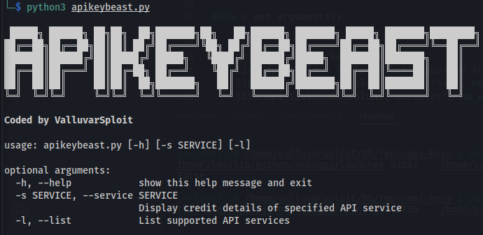
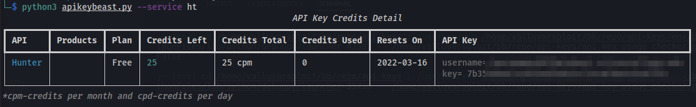

# APIkeyBeast
Track API keys credit usage in one place.

## API Keys
|API Key|Webiste|Comments|
|---|---|---|
|Alienvault|<a href="https://otx.alienvault.com/">Link</a>|Signup Required|
|Binary Edge|<a href="https://app.binaryedge.io/sign-up">Link</a>|Signup Required|
|BuiltWith|<a href="https://api.builtwith.com/free-api">Link<a/>|Signup Required|
|TLS BufferOverRun|<a href="https://tls.bufferover.run/"></a>|Signup Not rquired. Provide mail id to receive API key|
|CENSYS|<a href="https://censys.io/login">Link</a>|Signup Required|
|CHAOS Project Discovery|<a href="https://chaos.projectdiscovery.io/">Link</a>|Invite Only - Fill form|
|CloudFlare|<a href="https://cloudflare.com/"></a>|Signup Required|
|Github|<a href="https://github.com/">Link</a>|Signup Required|
|Gitlab|<a href="https://gitlab.com/">Link</a>|Signup Required|
|hunter.io|<a href="https://hunter.io/">Link</a>|Signup Required|
|IntelX|<a href="https://intelx.io/signup">Link</a>|Signup Required - Academic access available|
|IPdata|<a href="https://ipdata.co/">Link</a>|Signup Required|
|IPinfo|<a href="https://ipinfo.io/">Link</a>|Signup Required|
|Onyphe|<a href="https://onyphe.io/">Link</a>|Signup Required|
|Passive Total|<a href="https://community.riskiq.com/login">Link</a>|Signup Required|
|Security Trails|<a href="https://securitytrails.com/">Link</a>|Signup Required|
|Shodan|<a href="https://account.shodan.io/login">Link</a>|Signup Required - Academic access available|
|spamhaus.com|<a href="https://spamhaus.com/">Link</a>|Signup Required|
|Spyse|<a href="https://spyse.com/">Link</a>|Signup Required|
|urlscan.io|<a href="https://urlscan.io/">Link</a>|Signup Required|
|Virustotal|<a href="https://virustotal.com/">Link</a>|Signup Required|
|Network DB|<a href="https://networksdb.io/">Link</a>|Signup Required|
|WhoisXMLAPI|<a href="https://whoisxmlapi.com">Link</a>|Signup Required|
|recon dev API|<a href="https://recon.dev/account">Link</a>|Signup Required - No Service|
|ZoomEye|<a href="https://telnet404.com/">Link</a>|Signup Required|

## Installation
```bash
$ git clone https://github.com/the-valluvarsploit/APIkeyBeast.git
$ cd APIkeyBeast/
$ pip install -r requirements.txt
```

## Usage
```bash
# List supported APIs
$ python apikeybeast.py --list
# Show credit data for Alien Vault
$ python apikeybeast.py --service av
# Show credit data for all services
$ python apikeybeast.py --service all
```




